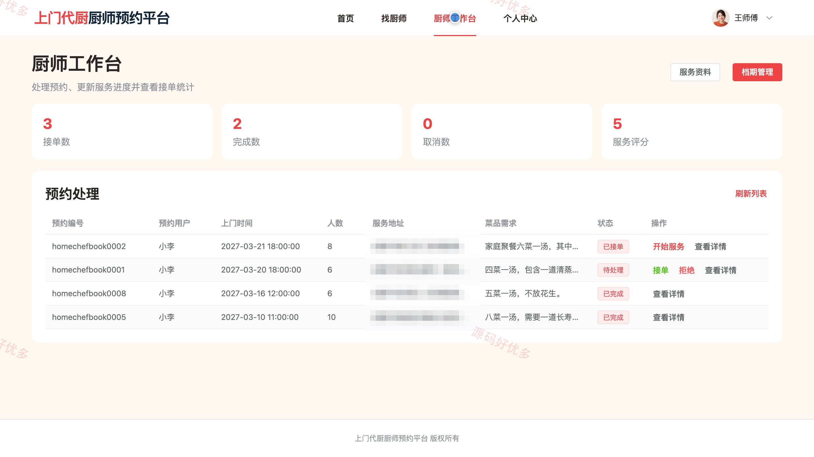
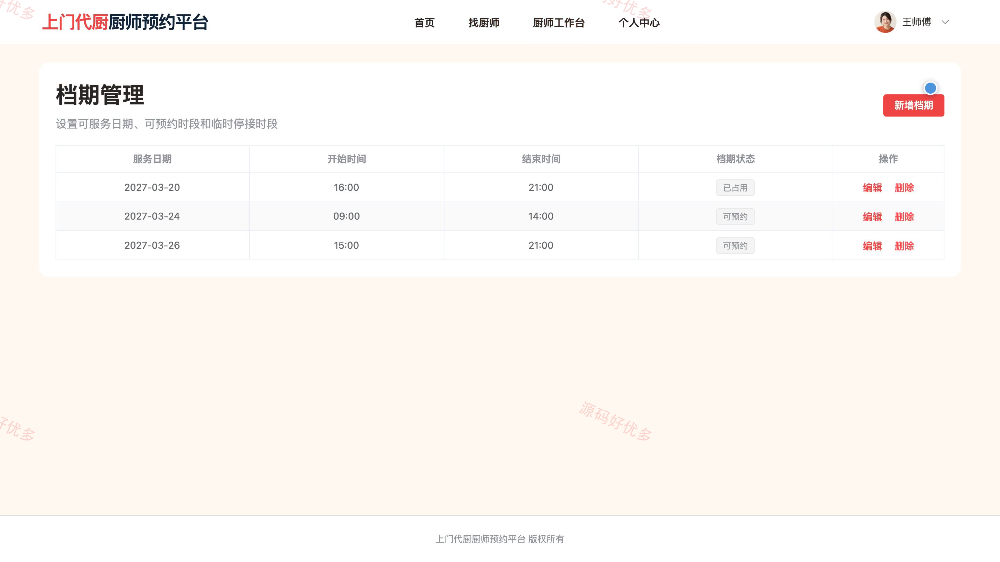
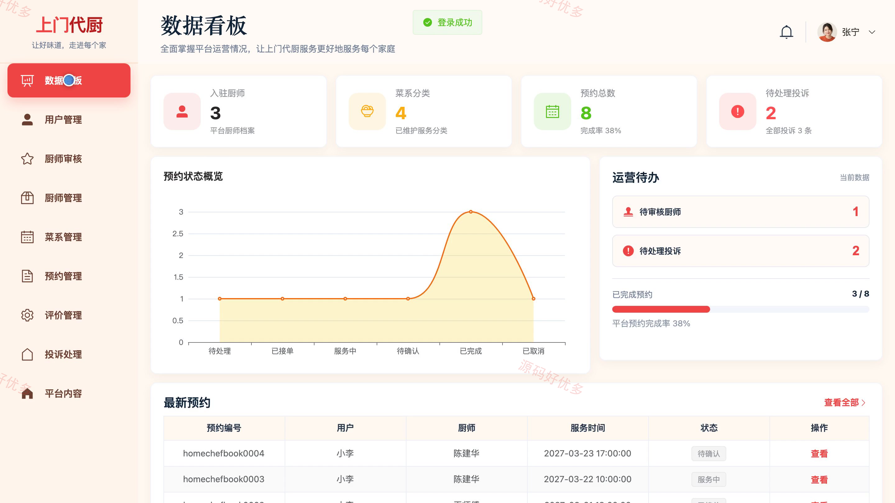
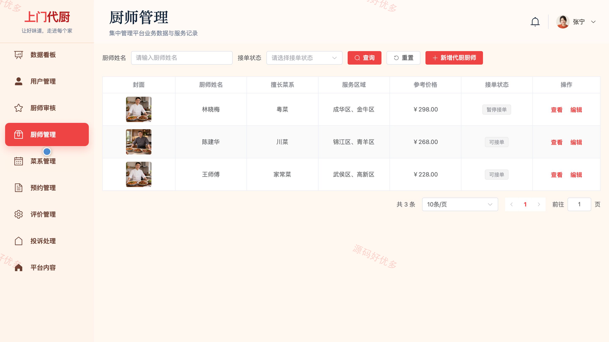
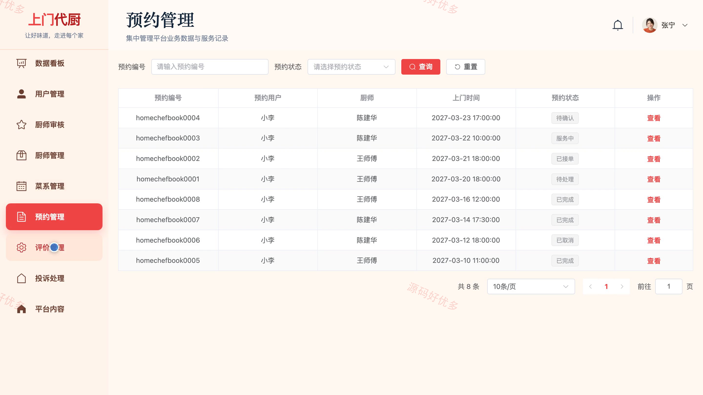
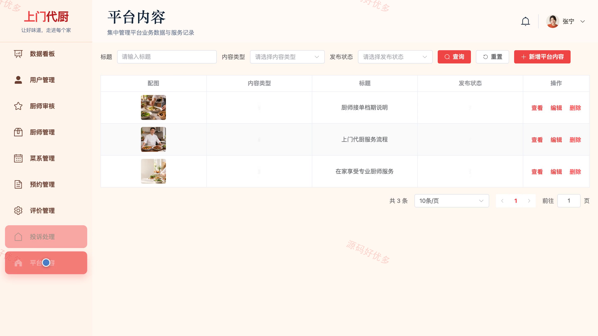

# bs116A
bs116A上门代厨厨师预约平台
## 源码问题查看主页咨询

### 一、关键词
上门代厨、私人厨师、厨师预约、家庭宴席、上门烹饪

### 二、作品包含
源码+数据库+万字设计文档+PPT+全套环境和工具资源+本地部署教程

### 三、项目技术
前端技术： Html、Css、Js、Vue3.4、Element-Plus
后端技术：Java、SpringBoot3.2.0、MyBatis-Plus

### 四、运行环境要求
开发工具：IDEA/eclipse + VSCODE

数据库：MySQL5.7+（共12张表）

数据库管理工具：Navicat10以上版本

环境配置软件： JDK17 + Maven3.6

前端Nodejs：16+

浏览器：谷歌浏览器

### 五、项目介绍
项目编号：bs116A

上门代厨厨师预约平台面向预约用户、代厨厨师和系统管理员，覆盖厨师筛选、档期查询、上门预约、接单履约、服务评价、投诉处理与平台运营等业务，实现从预约提交到服务完成的全过程协作。

角色：预约用户、代厨厨师、系统管理员

预约用户功能：厨师查找、厨师详情、档期查询、提交预约、订单管理、服务确认、服务评价、投诉反馈。

代厨厨师功能：厨师入驻、服务资料、档期管理、预约处理、订单详情、服务进度、评价查看、服务统计。

系统管理员功能：用户管理、厨师审核与管理、菜系管理、预约管理、评价管理、投诉处理、平台内容、数据统计。

### 六、运行截图

